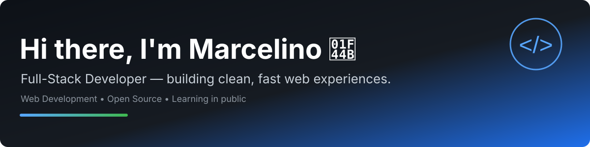

  

  
  
  
  
  

<!-- TODO: Replace the LinkedIn, Portfolio, and Instagram links above with your real URLs. -->

# Hi, I'm Marcelino 👋

I'm a **Full-Stack Developer** focused on **Web Development**. I build clean, responsive, and maintainable web applications, from intuitive frontends to solid backend APIs.

- 🌍 Based in Indonesia
- 💻 Working with modern JavaScript/TypeScript, PHP, and Python ecosystems
- 🌱 Currently learning in public and improving full-stack fundamentals
- 🎯 Interested in Web Development, Open Source, and clean architecture
- 📫 Reach me at **marselinojrg@gmail.com**

> Clean code, clear communication, consistent progress.

---

## 🔧 Tech Stack

---

## 📊 GitHub Stats

  
  

---

## Open for Collaboration

Full-Stack Developer open to freelance projects, internships, contract roles, and open source collaboration.

Core competencies:

- Frontend Development: React, Next.js, Vue.js, Tailwind CSS, Bootstrap, responsive web design
- Backend Development: Node.js, Express, Laravel, PHP, REST API design and authentication
- Databases: MySQL, PostgreSQL, MongoDB, Prisma ORM, database design and integration
- Workflow: Git, GitHub, Docker, code review, debugging, technical documentation

---

## Contact

- Email: marselinojrg@gmail.com
- GitHub: https://github.com/marcelinojrg
- LinkedIn: https://www.linkedin.com/ (TODO: replace with your real profile URL)
- Portfolio: (TODO: add your portfolio URL)

---

  Thanks for visiting. Let's build something useful. 🚀

